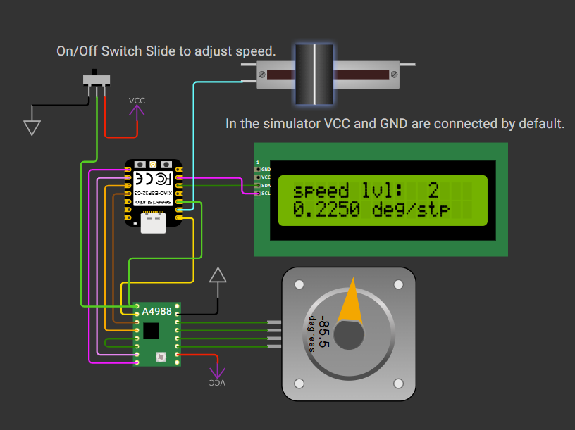

# Step motor speed adjusted by a slider

The MCU adjusts the motor speed using the A4988 control chip's speed setting pins. The PWM or pulse signal is sent at a constant rate.

There are many ways to control the speed—for example, using a PWM signal, or combining it with the motor speed pin settings to produce smoother speed steps.