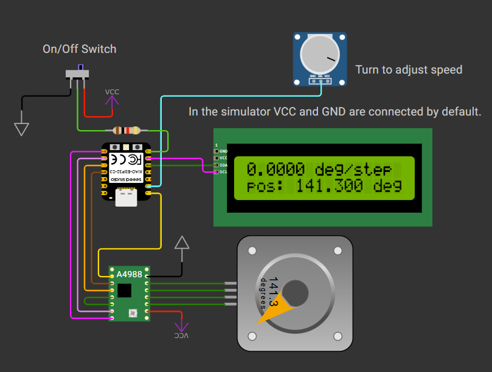

# Using FreeRTOS adjust step motor speed

This project uses the A4988 motor control chip's speed setting pin to adjust the step size of the motor. The pulse rate is kept constant.

The code runs three parallel threads:

* The pulse-sending thread, which has the highest priority. This routine includes a counter that measures the angular position of the motor.
* A routine to monitor the motor's switch.
* A routine to read the ADC value from the speed dial and display information on the LCD.

The priority for the pulse-sending thread is set to 2, while the other two threads use priority 1. This configuration works well in the simulator. However, setting the priority to 0 causes execution to become very slow.

Writing to the LCD will also slow down other functions if everything is placed inside the main loop. Using an RTOS is necessary when real-time processing is important.