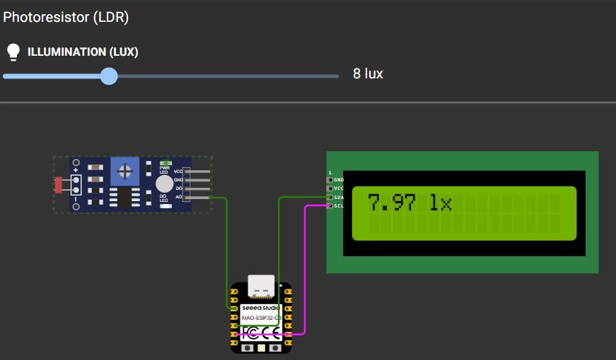

# LUX meter reader and conversion

This is a demo that acquires and converts readings from the [Wokwi photo sensor](https://docs.wokwi.com/parts/wokwi-photoresistor-sensor).

The display and reading routines here do not require real-time processing like motor control does. Therefore, it is acceptable to place them together inside the main loop.