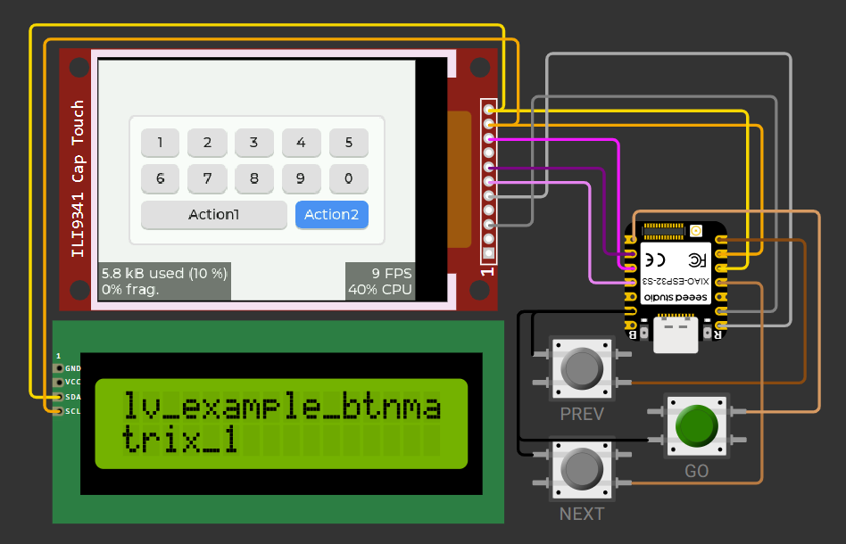

# LVGL all examples demonstration

This code displays all LVGL examples on a capacitive touch display. Use the PREV and NEXT keys to select which demo to play.

The code can be compiled with PlatformIO and run in the Wokwi simulator (VS Code version). If the simulator freezes, restart it, navigate to where it stopped using the grey keys, and press the green button to resume.