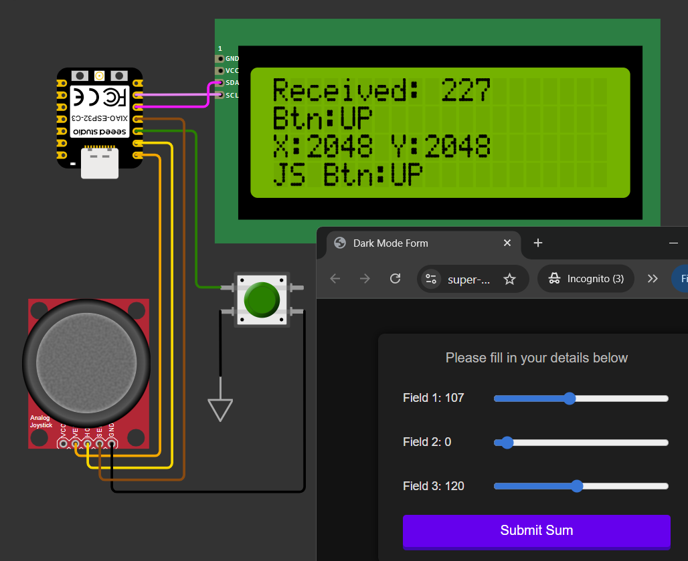

# Two way communication between ESP32 http server and client

Server which is the ESP32 can send data to webpage like contorl inputs and other data in XML format, while the webpage can send request and data back to server about potentially all page events.

The demo page has 3 input sliders which can be controlled on the page and by the joystick on the MCU. The submit button will send the sum of 3 inputs back to MCU to display, while this request also can be initiated by the MCU side green button. 

The functions are realized with all default Arduino libs. No additional libs are required. 

The code can be compiled by Platformio and run with Wokwi simulator (vscode ver.).

## Notes
### SPIFFS
The original try was to use the SPIFFS to store the html file and read them from the MCU. That will prevent recompiling the code every time the webpage code beeing changed. However, the file system can't work in the simulation, will test it with HW later.
### Pre build script
Using the script to cp the HTML code into the header file before compile. The script file can be specified in the platformio.ini file. 